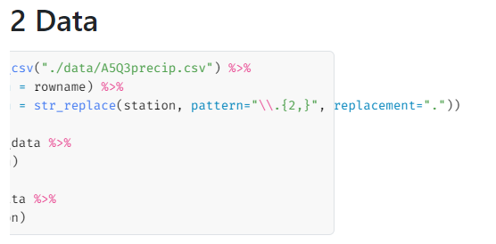
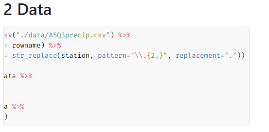

`rmd.css`: For use with R Markdown and Quarto HTML if the HTML file will be viewed on mobile
devices. When viewing long horizontal code on a mobile device, the background of the code block does
not cover the entirety of the code.

Without `rmd.css`:

With `rmd.css`:

*The difference is not visible if your screen is large enough such that you don't need to scroll
horizontally to view all the code.*

---

`slides.scss`: My current Quarto Reveal theme.
